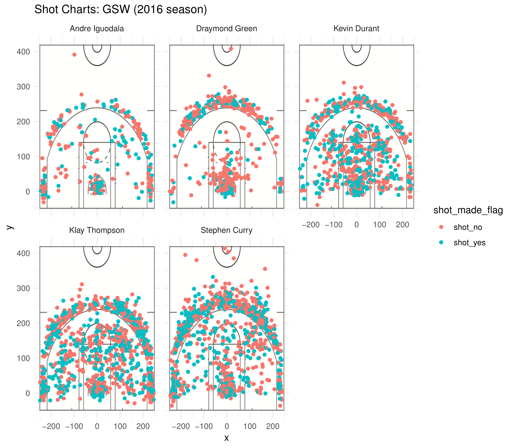

```{r setup, include=FALSE}
knitr::opts_chunk$set(echo = TRUE)
```

#Introduction
Considered the best superteam in the NBA in recent years, the Golden State Warriors had arguably the best starting five in the Western Conference, and maybe even the entire NBA. In the 2015-2016 the Warriors had a historic 73 win season, largely because of high efficiency shooting and scoring (Thompson and Curry aptly referred to as the Splash Brothers because of the large volume and accuracy of three point shots made). This is a visual demonstration and report of the shot data of each of the Warriors' starting five, combining shot charts with summaries and other visualizations to create a comprehensive overview of each player's performance.

#Breaking Down Each Player's Performance
The point guard of this team, Stephen Curry, is considered one of, if not the, best shooter in NBA history. 

```{r}
#libraries
library(jpeg)
library(grid)
library(dplyr)
library(ggplot2)
library(readr)
```

```{r, warning = FALSE, message = FALSE, echo = FALSE}
setwd("~/Desktop/stats133/workout01/report")
shots_data <- readr::read_csv("../data/shots-data.csv")
```

#2 pointers
```{r 2 pointers, echo = FALSE}
two_pointers <- shots_data[shots_data$shot_type == "2PT Field Goal", c("name", "shot_made_flag")] %>% group_by(name) %>% summarise(total = n(), made = sum(shot_made_flag == "shot_yes")) %>% mutate(perc_made = made/total) %>% arrange(desc(perc_made))
two_pointers
```

#3 pointers
```{r 3 pointers, echo = FALSE}
three_pointers <- shots_data[shots_data$shot_type == "3PT Field Goal", c("name", "shot_made_flag")] %>% group_by(name) %>% summarise(total = n(), made = sum(shot_made_flag == "shot_yes")) %>% mutate(perc_made = made/total) %>% arrange(desc(perc_made))
three_pointers
```

#shooting percentage
```{r Overall}
all_points <- shots_data[ , c("name", "shot_made_flag")] %>% group_by(name) %>% summarise(total = n(), made = sum(shot_made_flag == "shot_yes")) %>% mutate(perc_made = made/total) %>% arrange(desc(perc_made))
all_points
```

```{r label, out.width = "80%", include = TRUE, echo = FALSE, fig.align='center'}
library(knitr)

```


